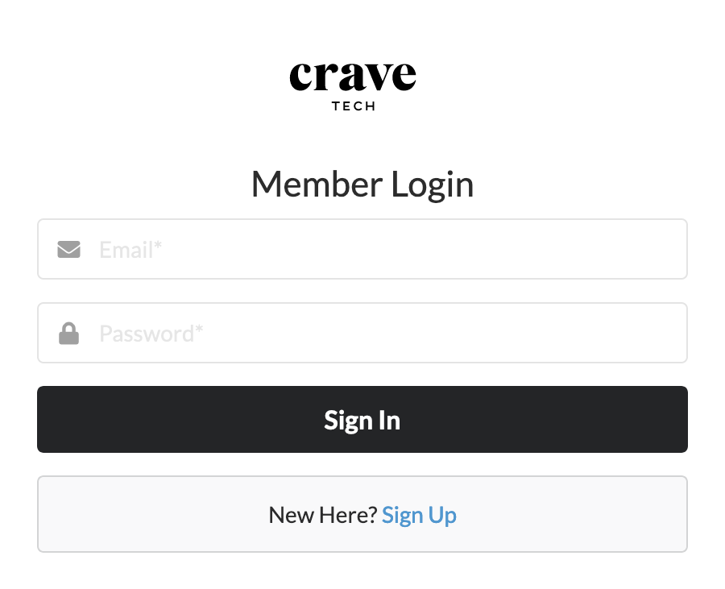
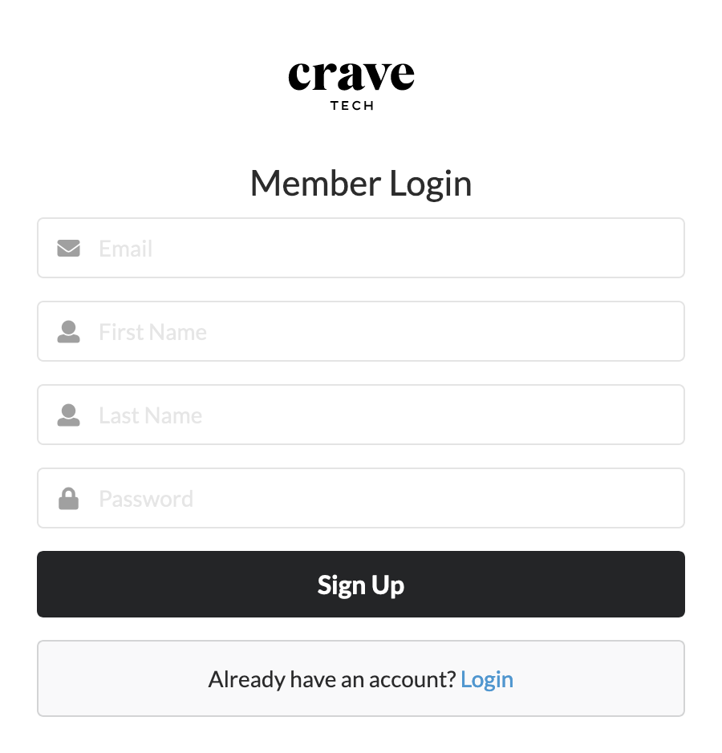
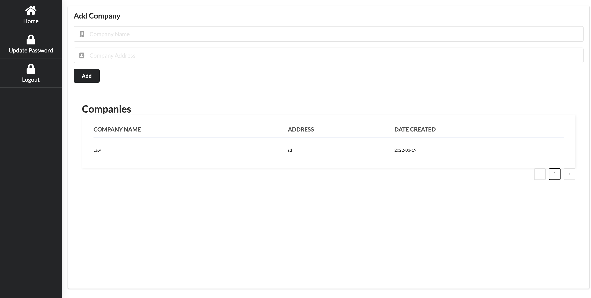
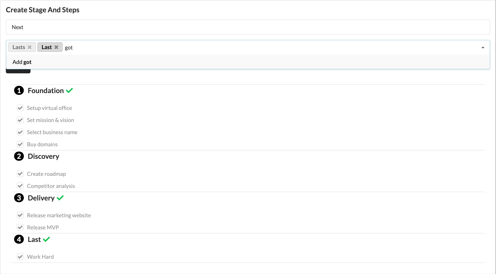
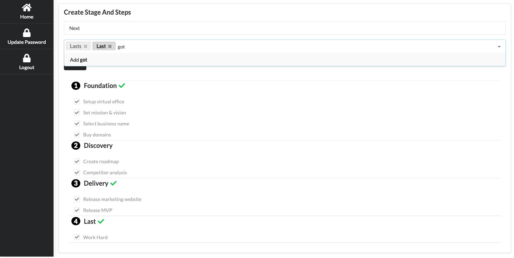

# Test Solution 

This solution was implemented using Graphql (Apollo) and React (Next.js)

###  How to run

* Open Terminal
* Run The following command
```
 git clone git@github.com:nwokolawrence6/crave_tech.git
```

### To Run App
```shell
cd crave_tech
```
* Run
```npm 
npm install
```

## Create a file in root project directory named

```shell
touch .env.local
```
* Edit file using nano
```shell
nano .env.local 
```
* Add the following:

```dotenv
MONGO_URL=mongodb://localhost:27017/test_crave #replace with the connection string found in the email.
NEXT_PUBLIC_GQL_URL=/api/graphql
NODE_ENV=development
```

## Note

**For Database connection find the Mongo connection string located in the email sent.
This database was created for testing purposes only, the server hosting the mongodb instance will be destroyed after the testing process is over.**

* To start app run
```npm
 npm run dev
```

visit the link below on your browser:
```http request
 http://localhost:3000
```

### Login 




### Sign Up



#### DashBoard



* This implementation allows user to have multiple organization progress being managed at the same time, as a user you can add multiple company's

After adding the organization you want to manage it will appear below
Select the organization just added.


# This is the progress management screen you can add multiple items in the steps as shown below







Among other things you can update your password too.

#### Todos 
- Update Page layout for a cleaner ui structure code.
- separate ui front-end from back-end for a clear developer experience and easy management.
- create a separate collection for managing company.
- Remove inline jwt rsa secret key and it to env

Happy testing
